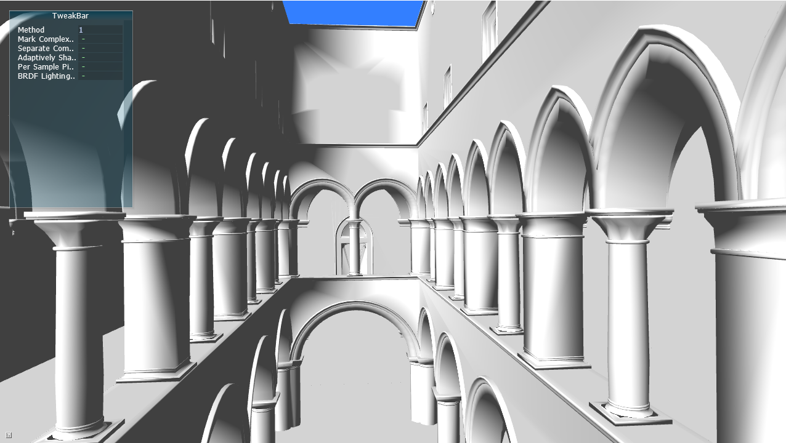
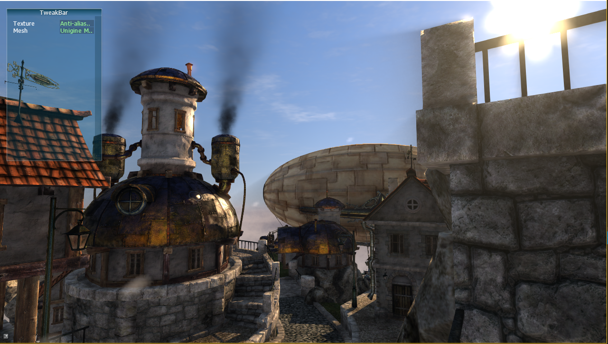

# Graphics

Welcome to **Graphics** which implements some of the real-time rendering and physics-based rendering papers. Note that the renderer used is my [Cooler](https://github.com/freehyan/Cooler) renderer.

## Anti-aliasing

Deferred shading does not support anti-aliasing, because the scene geometry information is separated. And these information can not support hadware anti-aliasing, it can only be resolved by some post-processing methods.

* Deferred Shading MSAA 

[Reference]: [Deferred Shading MSAA](http://nvidiagameworks.github.io/GraphicsSamples/DeferredShadingMSAASample.htm), NVIDIA Research.

 
* Deferred Shading MLAA

[Reference]: [Practical Morphological Antialiasing](https://books.google.com/books?hl=en&lr=&id=tixuGR3iDmUC&oi=fnd&pg=PA95&dq=Practical+Morphological+Antialiasing&ots=DclEj303q_&sig=rOr_fJ4RmuP09Li7UhG81Kcq_wU#v=onepage&q=Practical%20Morphological%20Antialiasing&f=false), Jorge Jimenez, 2011.

## License

**Graphics** is available as open source under the terms of the [MIT License](http://opensource.org/licenses/MIT).
