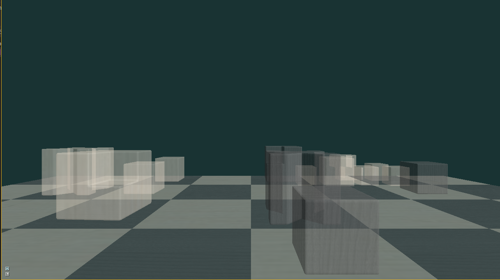

# Graphics

Welcome to **Graphics** which implements some of the real-time rendering and physics-based rendering papers. Note that the renderer used is my [Cooler](https://github.com/freehyan/Cooler) renderer.

## Anti-aliasing

Deferred shading does not support anti-aliasing, because the scene geometry information is separated. And these information can not support hadware anti-aliasing, it can only be resolved by some post-processing methods.

* Deferred Shading MSAA 

[Reference]: [Deferred Shading MSAA](http://nvidiagameworks.github.io/GraphicsSamples/DeferredShadingMSAASample.htm), NVIDIA Research.

 
* Deferred Shading MLAA

[Reference]: [Practical Morphological Antialiasing](https://books.google.com/books?hl=en&lr=&id=tixuGR3iDmUC&oi=fnd&pg=PA95&dq=Practical+Morphological+Antialiasing&ots=DclEj303q_&sig=rOr_fJ4RmuP09Li7UhG81Kcq_wU#v=onepage&q=Practical%20Morphological%20Antialiasing&f=false), Jorge Jimenez, 2011.

## Order-Independent Transparency

OIT traditional approach is to do a depth sort of transparent objects, and then render them from front to back's order. This algorithm uses the UAV new feature to build the linked list, efficiently and correctly render transparent object effects.

[Reference]: [Order-Independent Transparency using Per-Pixel Linked List](https://books.google.com/books?hl=en&lr=&id=zfPRBQAAQBAJ&oi=fnd&pg=PA409&dq=Order-Independent+Transparency+using+Per-Pixel+Linked+List&ots=WGkV_9NQto&sig=GlU-4NkQ1E6vVkpPsGYwwHx4t94#v=onepage&q=Order-Independent%20Transparency%20using%20Per-Pixel%20Linked%20List&f=false), Nicolas Thibieroz, 2011

## License

**Graphics** is available as open source under the terms of the [MIT License](http://opensource.org/licenses/MIT).
